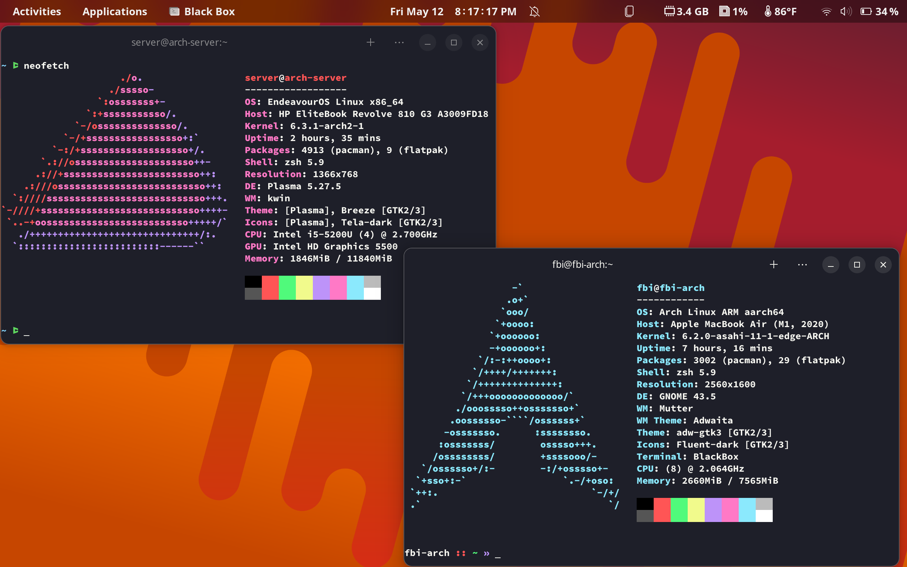
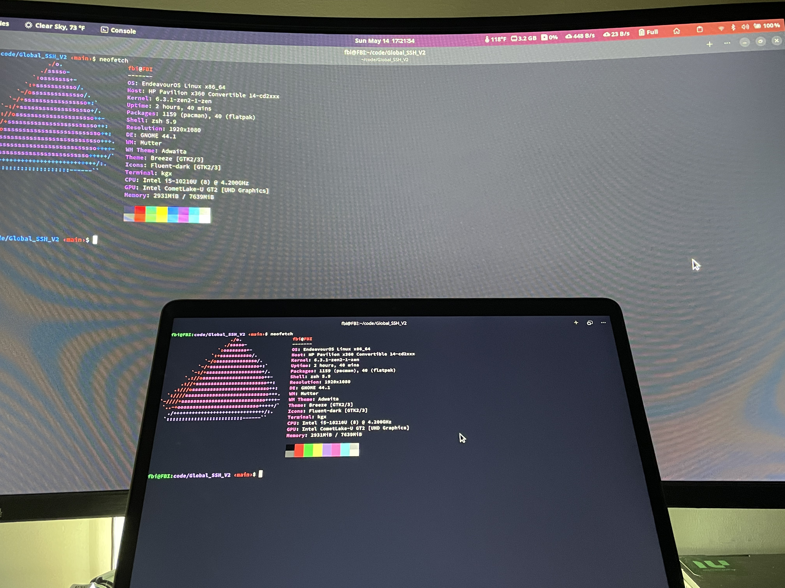
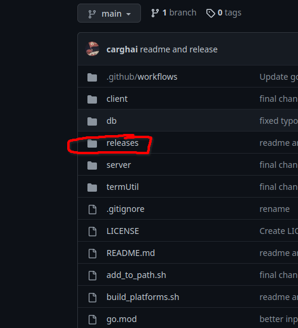
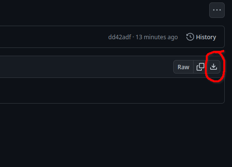
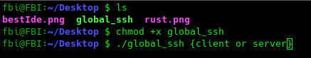
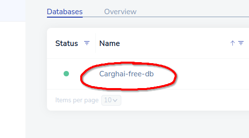

# Welcome To Global SSH Alpha! 🎉️

### Displaying Global SSH



### Showing Colaboration Feature




## Why Should I Use It?

SSH can be difficult to set up and maintain, requiring software installation and configuration on both local and remote systems, as well as firewall and access control configuration. Global SSH removes this complexity, making it accessible to non-technical users.

Moreover, Global SSH is more scalable than SSH, particularly in larger networks. With SSH, configuring and managing port forwarding settings becomes increasingly challenging as the network grows. Any changes or updates to port forwarding settings must be made on each device individually, which can be time-consuming and error-prone. In contrast, Global SSH requires only a Redis database to handle connections and can be easily scaled by creating new free accounts.

In summary, Global SSH offers an easier, more secure, and scalable alternative to SSH, with a simple setup process and minimal maintenance overhead.

## Features 🚀️

1. Easy setup: Global SSH can be set up in less than 5 minutes with a key file named redis_key.json placed in the home directory (~) of any Unix computer, making it easy to set up hosts or clients.
2. Low resource consumption: Global SSH is not resource-intensive and can even work in poor Wi-Fi conditions.
3. User-friendly: Global SSH is extremely easy to use, with a very low learning curve.
4. Easy switching between server and client: With Global SSH, you can easily switch between being a server or client by typing a simple command in the terminal. For server mode:`$ global_ssh server`, and for client mode:`$ global_ssh client`.
5. No port forwarding needed: Global SSH eliminates the need for port forwarding to connect hosts and clients across networks.
6. Platform agnostic: Global SSH client mode works on all platforms, including chips like 386 and ARM.
7. Unix compatible: Global SSH server mode works on all Unix-based systems, but not on Windows.
8. Colaboration Feature - Allows server and client to work on a shell together

# Setup 👀️

## Step 1: Install

1. First go to the release directory or vist this link https://github.com/carghai/global_ssh/tree/main/releases!

   
2. Next find your OS and chip, for example if I'm an apple user with an M1 chip I will look for dawrin(apple) os and the arm64 version, It will look like global_ssh_darwin_arm64.tar.gz. If you are on x86 machine look for amd. If you try to run the binary and it doesn't work then you installed the wrong version.
3. Now click it then hit the download buttion in the corner

   
4. Next extract the tar file or zip, this can be done by a tool or by the command line
5. If your on windows, open power shell and do ``Start-Process -FilePath “<Path/global_ssh>” ``, if your having problems look [here](https://www.technewstoday.com/how-to-run-exe-in-powershell/)
6. If you are on unix based os, go to the terminal and go into the directory of the **unzip** tar file. Then do these commands to run it.

   

## Step 2: Add To Path(unix based os only)

1. Run these commands, then reload your shell if this does not work look [here.](https://askubuntu.com/questions/440691/add-a-binary-to-my-path)

```
#!/bin/bash

echo "removing old binary"

sudo rm /usr/local/bin/global_ssh

echo "moving binary to path"

sudo mv global_ssh /usr/local/bin
```

2. To verify this work make sure to **fully close** you terminal app then try running. This **should not** return "command not found: global_ssh"

```
$ global_ssh
```

3. This is step is optional, however if you want to run it you will need to cd into the binary location and do ./global_ssh to run it.

## Step 3: Redis Setup

1. First go to [here](https://redis.com/try-free/) and setup your free redis cloud server(no credit card required)
2. Next click these buttions

   
3. Next click the database

   
4. Now you should see the data required to use Global SSH ex: Public endpoint,Username,Password
5. Now keep this window open

## Final Step: Connecting Global SSH with Redis

1. Now run global ssh on your computer, it should prompt you to put in your keys
2. Next put in the keys from the last step
3. When prompted pick database 0 (default)
4. Finally in your "C:\\" or next to the exe (windows) or your home directory(~) or next to the binary you should find redis_key.json.
5. Find the redis_key.json and move the file to any computer you want running Global SSH
6. While moving the file make sure it is in the your home directory(~) or next to the binary then run Global SSH
7. Now run ``global_ssh server`` on your server computer
8. Finally run ``global_ssh client`` on your client computer
9. Make sure it does not say "unable to find redis key file" otherwise you did not put it in the right place. However you can just make a new on right there too.
10. Enjoy Global SSH 😄
11. Be sure to reinstall to update Global SSH

# Limitations 😕

1. This project is very new and it still in early alpha so please report any bugs!
2. command like zellji with extremely heavy stdout are a bit glitchy, however this the only known command that suffers this bug.
3. There is bit more delay on compared to SSH

## Contributing/Future Plans

1. I have huge hope for this project an will continue to make this the best as I can
2. I'm currently working on making less latancy and improve commands that send massive amounts of stdout (zellji) run better
3. If you have any changes please be descriptive on what is does then I will check it then merge it.
