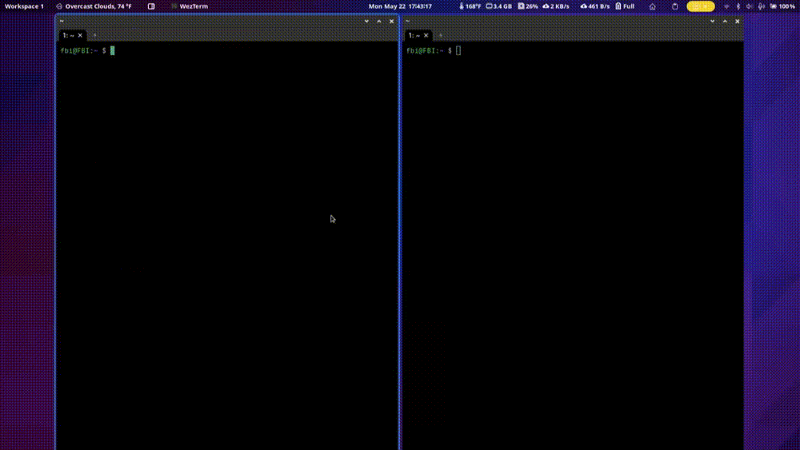

# Welcome To Global SSH Alpha! 🎉️

### Displaying Global SSH


### Showing Colaboration Feature


## Live Demo



## Why Should I Use It?

SSH can be difficult to set up and maintain, requiring software installation and configuration on both local and remote systems, as well as firewall and access control configuration. Global SSH removes this complexity, making it accessible to non-technical users.

Moreover, Global SSH is more scalable than SSH, particularly in larger networks. With SSH, configuring and managing port forwarding settings becomes increasingly challenging as the network grows. Any changes or updates to port forwarding settings must be made on each device individually, which can be time-consuming and error-prone. In contrast, Global SSH requires only a Redis database to handle connections and can be easily scaled by creating new free accounts.

In summary, Global SSH offers an easier, more secure, and scalable alternative to SSH, with a simple setup process and minimal maintenance overhead.

## Features 🚀️

1. Easy Setup: Set up Global SSH in less than 5 minutes by placing the key file (redis_key.json) in
   the home directory (~) of any Unix computer. This streamlined process allows for quick configuration of hosts or clients.
2. Network Scalability: Global SSH eliminates the need for port forwarding, making server-client connections across networks effortless and efficient. Say goodbye to the complexities of managing port forwarding settings as your network grows.
3. Low Resource Consumption: Global SSH is designed to be lightweight and not resource-intensive, ensuring optimal performance even in poor Wi-Fi conditions.
4. User-Friendly Interface: We have prioritized creating an intuitive and user-friendly experience with Global SSH. The platform offers a minimal learning curve, enabling users of all technical expertise levels to navigate and utilize it effectively.
5. Seamless Mode Switching: Transitioning between server and client modes is a breeze with Global SSH. By issuing simple commands in the terminal, you can easily switch between being a server or a client:

   * Server Mode: $ `globalssh server`
   * Client Mode: $ `globalssh client`
   * Client Mode(different host) $ `globalssh client {hostname}`
6. No Port Forwarding Needed: Global SSH removes the requirement for port forwarding, simplifying the process of connecting hosts and clients across networks. Say goodbye to the complexities of managing port forwarding settings.
7. Platform Agnostic: Global SSH's client mode is compatible with all platforms, including chips like 386 and ARM.
8. Unix Compatibility: Global SSH's server mode works seamlessly on all Unix-based systems, ensuring wide compatibility across various platforms. Please note that server mode is not supported on Windows.
9. Collaboration Feature: Global SSH enables server and client collaboration, allowing them to work together in a shared shell environment.
10. Enhanced Security:

* Global SSH provides robust security measures to safeguard your server and client connections.
* Enjoy an additional layer of anonymity as Global SSH cannot be easily discovered or traced back to a specific location.
* The Redis server used in Global SSH acts as a proxy, effectively concealing your server's IP address and making it significantly harder for potential attackers to target your system.
* AES encryption is integrated into Global SSH, ensuring the confidentiality of data transmission between the server and client.
* Global SSH's design ensures that no data is stored through the Redis server, minimizing the risk of an attack even if the Redis server is compromised.

# Setup 👀️

## Step 1: Install(requires golang)

1a. You can install and update the code with this command(recommended) 
```
$ bash <( curl -s https://raw.githubusercontent.com/carghai/globalssh/main/install.sh)
```
1b. You can also install via go install 

````
$ go install github.com/carghai/globalssh@latest
````

2. To verify this work make sure to **fully close** you terminal app then try running. This **should not** return "command not found: globalssh"

```
$ globalssh
```

## Step 2: Redis Setup

1. First go to [here](https://redis.com/try-free/) and setup your free redis cloud server(no credit card required)
2. Next click these buttions

   
3. Next click the database

   
4. Now you should see the data required to use Global SSH ex: Public endpoint,Username,Password
5. Now keep this window open

## Final Step: Connecting Global SSH with Redis

1. Now run global ssh on your computer, it should prompt you to put in your keys
2. Next put in the keys from the last step
3. When prompted pick database 0 (default)
4. Finally in your "C:\\" or next to the exe (windows) or your home directory(~) or next to the binary you should find redis_key.json.
5. Find the redis_key.json and move the file to any computer you want running Global SSH
6. While moving the file make sure it is in the your home directory(~) or next to the binary then run Global SSH
7. Now run ``globalssh server`` on your server computer
8. Finally run ``globalssh client`` on your client computer
9. Make sure it does not say "unable to find redis key file" otherwise you did not put it in the right place. However you can just make a new on right there too.
10. Enjoy Global SSH 😄
11. Be sure to reinstall to update Global SSH

## How Do You Use It?

1. Run ``globalssh server`` on your host pc. It should say "Redis Connection Verfied And Working, Starting Global SSH!" and go into a into a shell. If there are no error messages you are now in globalssh. You can type in commands and other if connected will see it
2. To connect to your server make sure you have the same redis_key.json in the ~ location and run ``globalssh client`` if you did everything right, you should see a neofetch command go off when you connect to your server. You can now type in commands, just note what every you type can be seen on the server computer. 
3. If you want to connect to other servers you can run ``globalssh client {server name}``

# Limitations 😕

1. This project is very new and it still in early alpha so please report any bugs!
2. command like zellji with extremely heavy stdout are a bit glitchy, however this the only known command that suffers this bug.
3. There is bit more delay on compared to SSH

## Contributing/Future Plans

1. I have huge hope for this project an will continue to make this the best as I can
2. I'm currently working on making less latancy and improve commands that send massive amounts of stdout (zellji) run better
3. If you have any changes please be descriptive on what is does then I will check it then merge it.

``1k lines of code``
